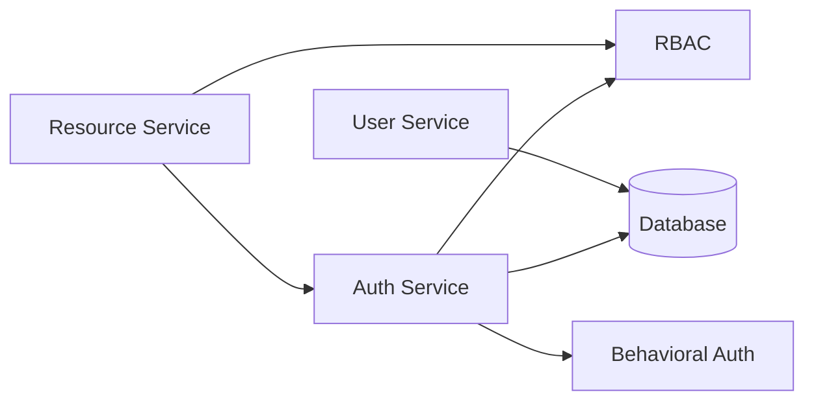
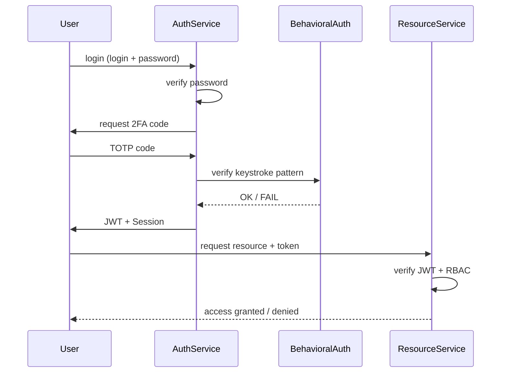
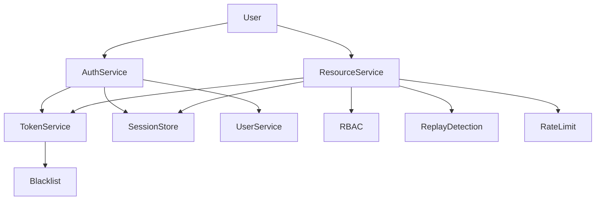
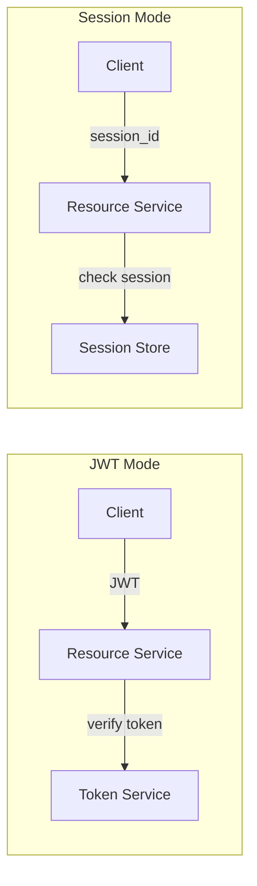

# Authentication & Authorization System (JWT + MFA + Behavioral Auth)

## Project Overview
This project implements a secure authentication and authorization system simulating a microservices architecture.

It includes:

- Multi-factor authentication (2FA)
- Behavioral authentication (keystroke dynamics)
- JWT-based authentication
- Session-based authentication
- Role-Based Access Control (RBAC)
- Security mechanisms (token expiration, blacklist, replay detection)

The system is designed to reflect real-world SaaS security architecture.

---

## System Architecture Diagram (microservises)

### System Flow

```
User (Client)
   ↓
AuthService → authentication (login + 2FA) → issues JWT / session
   ↓
BehavioralAuth → optional keystroke verification (MFA)
   ↓
ResourceService → validates token / session
   ↓
RBAC → checks user role and permissions
   ↓
Access granted / denied
```




---

## Full Authentication Flow (MFA + Behavioral Auth + JWT)
This diagram represents a full multi-factor authentication flow including behavioral verification.



---

## Features

### Authentication
- Username & password login
- Secure password hashing (bcrypt)
- Two-Factor Authentication (TOTP via Google Authenticator)
- Behavioral authentication (keystroke dynamics)

### Authorization
Role-Based Access Control (RBAC)
Roles:
admin → full access
user → limited 

### Token System
- JWT (short-lived access token)
- Refresh token
- Token expiration handling

### Behavioral Authentication 
- Learns typing patterns during registration
- Measures time between keystrokes
- Verifies user behavior during login


### Session System
- Session-based authentication (alternative to JWT)
- Session storage in memory
- Session invalidation (logout)


### Security Mechanisms
- Access denied without authentication
- Token expiration handling
- Role-based restrictions (RBAC)
- Replay attack detection
- Rate limiting (per user)
- Logout (JWT blacklist + session removal)
- Test Scenarios

---

### The system demonstrates:

- User login
- Valid token → OK
- Missing token → FAIL
- Wrong role → FORBIDDEN
- Token expiration → FAIL
- Refresh token → new access granted
- JWT vs Session differences
- Logout (JWT + session)
- Replay attack detection



---

### JWT vs Session diagram


---

### Example Behavior
- Scenario	Result
- Valid admin token	ADMIN DATA
- Missing token	FAIL
- User accessing admin resource	FORBIDDEN
- Expired token	FAIL
- Replay attack	DETECTED

---

### Technologies
- Python 3
- bcrypt – password hashing
- pyotp – 2FA (TOTP)
- qrcode – QR generation
- pyjwt – JWT handling

---

### Project Structure

```
auth-system/
│
├── README.md
├── requirements.txt
│
├── auth_service/
│   ├── __init__.py
│   ├── auth.py
│   ├── token_service.py
│   └── session_store.py
│   └── token_blacklist.py   
│
├── user_service/
│   ├── __init__.py
│   └── user.py
│
├── resource_service/
│   ├── __init__.py
│   └── resource.py
│
├── behavioral_auth/
│   ├── __init__.py
│   └── keystroke.py
│
├── rbac/
│   ├── __init__.py
│   └── roles.py
│
├── database/
│   ├── __init__.py
│   └── db.py
│
├── rate_limit.py
│
├── replay_detection.py
│
└── main.py
```

---

### How to Run
1. Install dependencies

```
pip install -r requirements.txt
```

2. Run the application

```
python main.py
```

---

### Key Concepts
- Authentication → verifies identity (login, 2FA, keystroke)
- Authorization → determines access (RBAC)
- JWT vs Session → stateless vs stateful authentication

---

### Conclusion

This project demonstrates a complete authentication system combining:

- Traditional login
- Multi-factor authentication
- Behavioral biometrics
- Token-based security
- Microservice-like architecture

It reflects real-world security design principles used in modern cloud systems.

