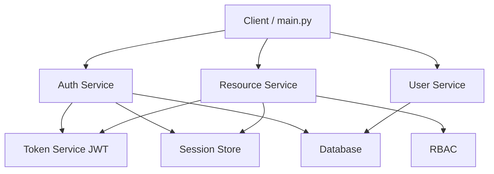
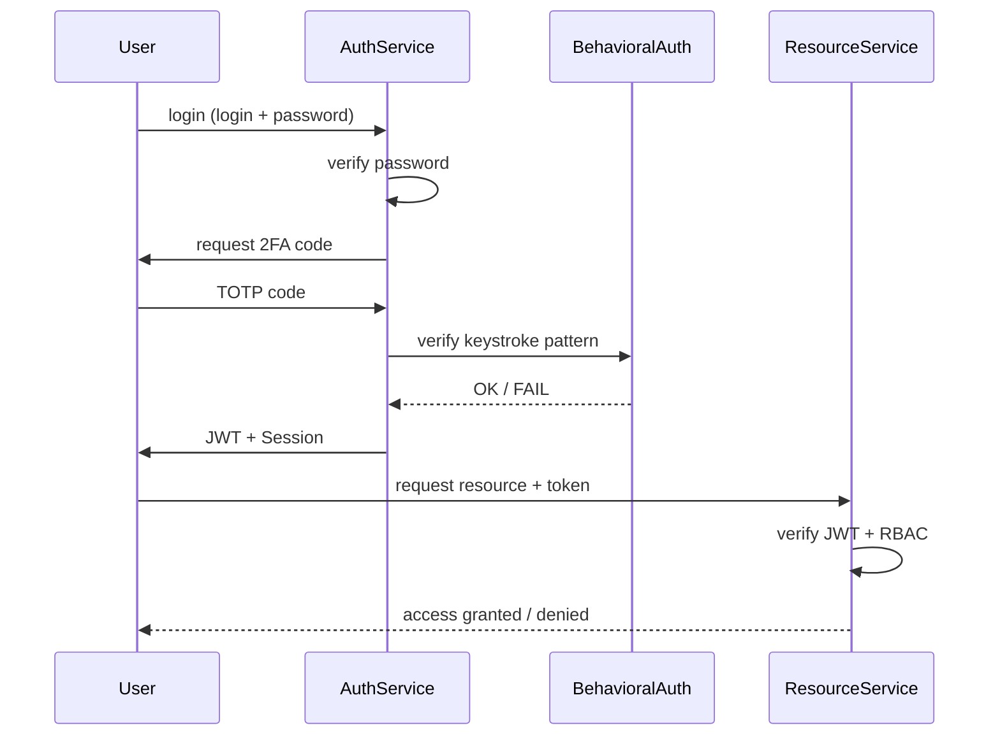
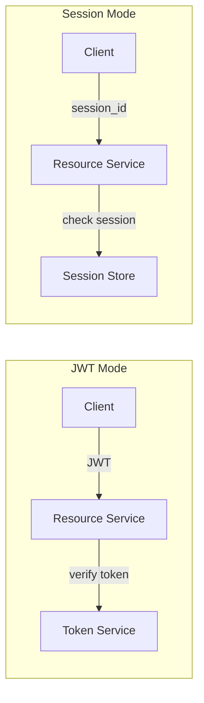
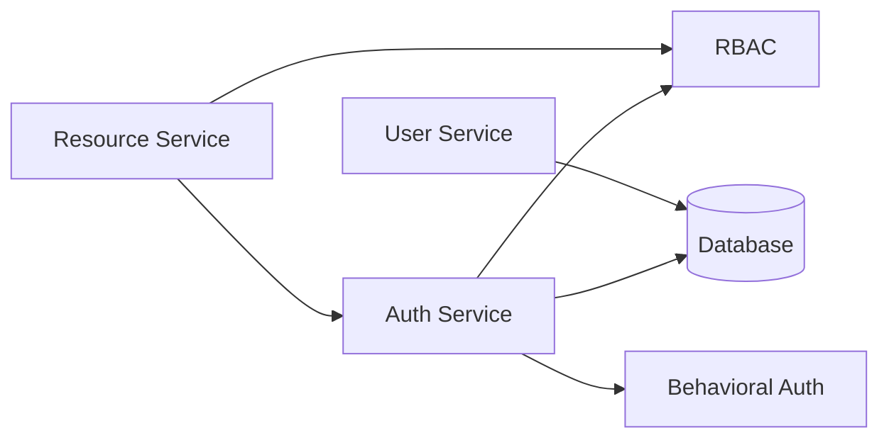

# auth-system-microservices
Multi-factor authentication system with RBAC, JWT, sessions and behavioral biometrics (keystroke dynamics) implemented in microservices-style architecture.


---

```
auth-system/
│
├── README.md
├── requirements.txt
│
├── auth_service/
│   ├── __init__.py
│   ├── auth.py
│   ├── token_service.py
│   └── session_store.py
│
├── user_service/
│   ├── __init__.py
│   └── user.py
│
├── resource_service/
│   ├── __init__.py
│   └── resource.py
│
├── behavioral_auth/
│   ├── __init__.py
│   └── keystroke.py
│
├── rbac/
│   ├── __init__.py
│   └── roles.py
│
├── database/
│   ├── __init__.py
│   └── db.py
│
└── main.py
```

---

## 1. Architecture Diagram (microservises)


```
main.py
   ↓
AuthService → login → JWT / session
   ↓
ResourceService → sprawdza token / sesję
   ↓
RBAC → sprawdza role
   ↓
BehavioralAuth → opcjonalna dodatkowa weryfikacja
```




---

## 2. Login Diagram (2FA + MFA)



---


## 3. JWT vs Session diagram




---

## 4. System Structure




---

## How to run 

```
pip install -r requirements.txt
```

```
python main.py
```


